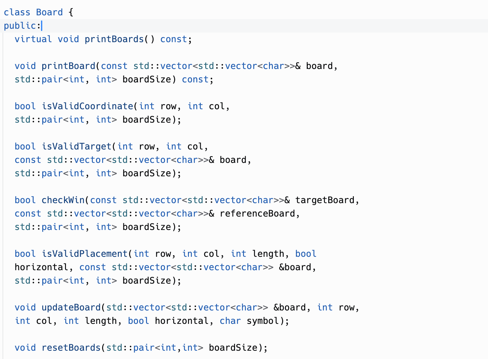
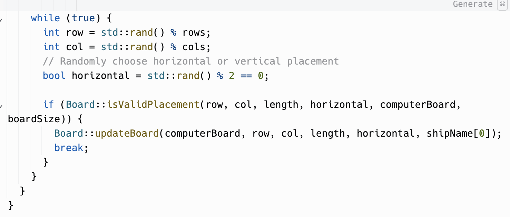
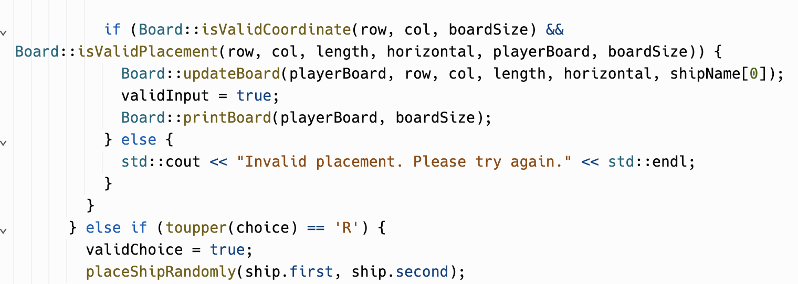
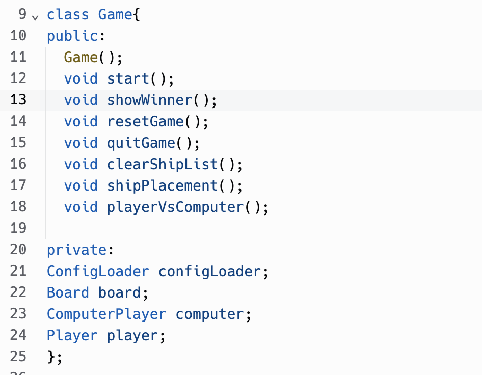
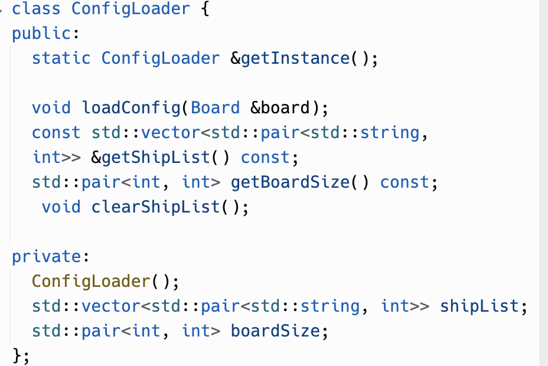

# AdaShip_APR_2 Project
This is AdaShip game, a reperesentation of the classical Battleship game,  created with C++ for the advanced programming module week 2.

# Getting Started:
This code can easily be setup and run with the use replit web based compiler, (I haven't personally setup and run the game in VS Code) however it should be possible to run it with Visual Studio Code locally too, as long as C++ compiler is installed loacally as well as the .run extension for VS Code in order to run the code.

## Prerequisites:
### For VS Code loacally:
1. MinGW-w64 C++ code compiler installed.
2. .run VS Code Extension installed.
3. C/C++ Extension Pack for VS Code installed.

### For Replit:
1. Access to internet and Replit web compiler.

## Running the code on VS Code:
1. Download or clone this repository.
2. Open folder in VS Code.
3. Make sure to have all the necessary prerequisites installed.
4. Run game using play symbol on the top-right side of VS Code window.

## Running the code with Replit
1. Download or clone this repository using the "Shell" tab avaialable on Replit.
2. Make sure you have .ini file with available data for the game.
(e.g.
Board: 10x10
Boat: Carrier, 5
Boat: Battleship, 4
Boat: Destroyer, 3
Boat: Submarine, 3
Boat: PatrolBoat, 2
)
3. Run the game using the incorporated "Run" button available in Replit. 

# The Game Rules:
---------->

# 1. Challenge Outline
## a. Summary and Review
The challenge was making a digital console based version of the vintage Battleship game. Following the simple rules of the game, two players take turns placing a fleet of ships on a grid and attempting to guess the coordinates of the other player's ships in order to sink them in the Battleship game. Accurately simulating the game dynamics, offering an interactive console based version, allowing user to manually and automatically place ships, as well as putting in place a winner-determination system are the main objectives.

### Challenges encountered:
- Ensuring a fair starting position for both players and preventing overlaps by designing an effective ship placement.
- Putting in place a turn-based mechanism that lets players swap out movements without changing the overall state of the game.
- Creating a reliable function for determining the winner by checking if all ships are sunk.
- Handling user input and providing appropriate validation to prevent incorrect or illegal moves.

## b. UML Style Diagram
UML-style diagram illustrating use class diagrams: https://miro.com/app/board/uXjVN9WyO3w=/?share_link_id=979256034582

## c. Initial Working Plan
Overall Approach to Development:

### Requirements Gathering:
First thing was reading and understanding the requirements of the Battleship game, from the assignment document, including functionalities, rules, and user interactions.

### Design and Architecture:
- I have created a simple design for the game, defining classes, relationships, and interactions between these.
- Then I considered principles of object-oriented design, keeping the code modular and extensible.

### Development Strategy:
My development strategy was to break down the project into manageable phases, which helped in implementation of basic functionalities first (e.g. reading the config file, printing the board on the console, placing ships, and taking turns between players) before moving to more advanced features.

### Code Standards and Style:
To ensure that I follow good coding standards I have read the following C++ coding standards article (link: https://www.scaler.com/topics/cpp/cpp-coding-standards/Enforce). Following that I made sure to use good coding standards, such as: #define guards for every header file (making sure there are no duplications within the code), inline comments to ensure readability of the code and easy understanding of more complicate functions. In addition to that I made sure to use good naming conventions ensuring good readability and exception handling to prevent illegal moves and invalid input.

### Version Control:
For version control I have used Git to track changes, and easily roll back to previous states if needed.

### Refactoring:
I have regularly reviewed and refactored the code to improve its design, readability, and maintainability.

## d. Analysis and Decomposition
It is really important to analyse and decompose a project in order to make sure the way it is being buil ensures its robustness and that it meets the initial requirements, therefore before writing any code I have decomposed the project into the following subtasks, which helped have a better understanding of the game's functionality and user requirements:  
### Game Initialization:
*Subtasks:*
- Set up the game board.
- Place ships on the board.
*Purpose:*
- Initializing the game board and placing ships are fundamental to the game's start.
- This task sets the foundation for subsequent interactions.

### Turn-Based Gameplay:
*Subtasks:*
- Implement player turns.
- Implement computer turns.
- Handle shots, hits, and misses.
*Purpose:*
- Turn-based gameplay is core to Battleship.
- Accurate handling of turns and shots is crucial for the game's flow.

### Win/Lose Conditions:
*Subtasks:*
- Check for a winning condition.
- Handle game termination and victory/defeat messages.
*Purpose:*
- Defining win/lose conditions is essential for game completion.
- This task directly affects the game's lifecycle.

### Input Validation:
*Subtasks:*
- Validate user input for ship placement.
- Validate shot coordinates.
*Purpose:*
- Input validation ensures game integrity.
- Prevents accidental or malicious disruptions during gameplay.

### Scalability and Extensibility:
*Subtasks:*
- Design for different board sizes.
- Allow for variations in ship types and quantities.
*Purpose:*
- Scalability accommodates different player preferences.
- Extensibility supports future updates and additions.

## e. Object-Oriented Design
The initial Object-Oriented Design idea and tasks plan breakdoes was the same one that I have followed and adjusted it accordingly throughout the development of the Battleship game. This Object-Oriented Design helped me develop the game with a better understanding and with ease ensuring that I follow good coding standards, and the tasks breakdown can be seen below.

### Object-Oriented Design Ideas:

#### Class Hierarchy:
*Classes:*
- Game: Represents the overall game logic and menu.
- Player: Represents a player with methods for placing ships auto and manually, as well as taking turns.
- ComputerPlayer: Represents the computer with method for auto ship placement and taking turns.
- Board: Represents the game board, including checking placements, coordinates and even checking win condition.
- ConfigLoader: Represents the method that is used to read the ship and board info from the .ini file.

**Phased Breakdown into Smaller Tasks:
Phase 1 - Game Initialization and Basic Gameplay:
- Task 1: Implement basic classes (ConfiLoader, Board, Game, Player, ComputerPlayer).
- Task 2: Set up the game loop and initialization logic.
- Task 3: Display the board.
- Task 4: Allow ship placement on the boards.

Phase 2 - Turn-Based Gameplay and Win/Lose Conditions:
- Task 5: Implement turn-based gameplay between players.
- Task 6: Handle shots, hits, and misses on the board.
- Task 7: Check for win/lose conditions and terminate the game.

Phase 3 - Input Validation and Board State Management:
- Task 8: Implement input validation for ship placement and shots.
- Task 9: Add functionality for saving and loading game states.

Phase 4 - Scalability and Extensibility:
- Task 10: Design for different board sizes and ship variations.
- Task 11: Allow for future updates and additions.

# 2. Development
## a. Adoption and Use of 'Good' Standards
Adhering to coding, documentation, and version control standards is crucial for creating and maintaining high-quality software. Below are some of the standards and best practices that I have adopted for the Battleship game project:

### Coding Standards:
#### 1. Naming Conventions:
- I have used descriptive and meaningful names for variables, functions, and classes.
- I consistently used camelCase for variables and functions, PascalCase for classes.

#### 2. Code Formatting:
- I have tried to maintain a consistent code style across the entire project.
- I used the replit formatter to nicely arrange the code.

#### 3. Comments:
- I used comments to explain complex logic or tricky parts of the code.

#### 4. Modularization:
- I made sure to break down the code into modular components for better maintainability.

### Version Control Standards:
#### 1. Git Flow:
- I adopted the Git Flow branching model for organized development and dedicated branches.
- I used branches for feature development, bug fixes, and releases.

#### 2. Commit Messages:
- For each branch I have writen clear and descriptive commit messages.
- In addition to that I have tried to name the branch based on the features that were being developed.

## b. & c. Phase-wise Development

## Phase 1 - Game Initialization and Basic Gameplay:

### Task 1: Implement basic classes (ConfigLoader, Board, Game, Player, ComputerPlayer).
- I defined and developed the fundamental classes outlined in the initial design.
- I ensured the proper encapsulation and separation of concerns.

### Task 2: Set up the game loop and initialization logic.
- I created a robust game loop that manages player turns and overall game flow.
- Then I implemented initialization logic for setting up the game state.

### Task 3: Display the board.
- Developed methods for reading and displaying the game board.
- Separated the player board from the computer's board.

### Task 4: Allow ship placement on the boards.
- Implemented ship placement logic for both manual and automatic modes.
- Validate ship placements according to the game rules, checking for overlaps.

## Phase 2 - Turn-Based Gameplay and Win/Lose Conditions:

### Task 5: Implement turn-based gameplay between players.
- I then developed the functions responsible of player turns and computer-controlled turns.
- Ensuring a fair and engaging gameplay.

### Task 6: Handle shots, hits, and misses on the board.
- I developed a simple mechanism for players to take shots at opponent boards.
- Then based on that I have managed and updated the target boards based on shot outcomes.

## Task 7: Check for win/lose conditions and terminate the game.
Implement the win/lose conditions based on the state of the game boards.
Ensure proper termination of the game when a win or lose condition is met.

## Phase 3 - Input Validation and Board State Management:

### Task 8: Implement input validation for ship placement and shots.
- Enhanced the user interface by validating and handling user inputs effectively.
- Prevented invalid ship placements and shots with input validation.

## Phase 4 - Scalability and Extensibility:

### Task 9: Design for different board sizes and ship variations.
- I enhanced the flexibility of the game by allowing different board sizes and ship configurations available through the config file.

## e. Ensuring Quality Through Testing
To ensure the quality of the Battleship game, involved a comprehensive testing strategy that covered various aspects of functionality. Below I have outlined the testing strategy and how I addressed bugs:

### Testing Strategy:
Initially I was testing the game as I was developing it, and I have done that the following way. First I made sure I was familiar with the game requirements, after that I have dived into a research of the game rules for the classic Battleship, this helped me understand the way the game is expected to behave and what rules it should enforce on the players, ensuring a smooth game. As a start I tested the interaction between the files, making sure that other classes' methods were accessible to the required files and different components, ensuring seamless integration. For example: I have checked that player turns interacted correctly with the game board, and shots were processed accurately.

Another test I had conducted was related to the user interface available within the console. I ensured a user-friendly interface with testing focused on user inputs and outputs. For example: I made sure the boards were being displayed correctly, each cell being inline, then I have validated user input for ship placements and shots, and verified that the displayed target boards accurately reflected the game state.

In addition to that I have performed regression testing after implementing new features or fixing bugs to ensure existing functionality remained intact. For example: I constantly checked that changes made to the auto ship placement algorithm and player turn did not break existing gameplay logic and continued to function as expected.

### Bug Addressing:
For example one of the bugs I had was related to the auto ship placement function, the exact issue was that I was iterating over the rows and columns of the board in a wrong way, therefore the loop was becoming infinite and it was causing the program to terminate. To identify what was causing that I had to include debug messages that would get printed on the console, this helped me to verify the flow of the function and to identify what exactly was causing the bug. This approach is called iterative development approach and it is considered and good technique for fixing bugs as soon as they are identified.

## f. Reflection on Design Challenges
During the development of the Battleship game, I have encountered several design challenges. Below I have described some of the key challenges, along with examples of innovative solutions that contribute to the overall quality of the code:

- Challenge: It was quite a challenge to ensure that I design a robust system for user input validation during ship placement, ship targeting and menu navigation.
- Solution: To ensure that the input validation was robust I implemented a multi-step validation process, checking for valid coordinates, ship placements, ensuring no overlap, as well as making sure the ship does not go beyond board bounds. I used separate functions and if statements to gracefully handle invalid inputs and provide informative feedback to the user.

- Challenge: Ensuring consistent and accurate representation of the game state throughout turns.
- Solution: I made sure to use the same instance of the player and computer board in order to be able to properly check if a fired torpedoe was a hit or a miss. and each time the player and computer board were updated separately and checked for the win condition. This system ensures synchronization between the logical game state and the visual representation on the board, preventing inconsistencies.

- Challenge: Avoiding redundancy in code, especially in handling similar game mechanics for players.
- Solution: Created a well-defined class hierarchy where common functionalities are encapsulated in base classes. This promotes code reuse and minimizes duplication, enhancing code maintainability and readability.
These design challenges were addressed through careful planning, iterative development, and a commitment to following best practices. The innovative solutions not only resolved immediate challenges but also contributed to the overall quality of the code by making it more modular, adaptable, and maintainable.

# 3. Evaluation
## a. Code Refactoring, Reuse, Smells
Analyze instances of code refactoring, code reuse, and identification/remediation of code smells. Use specific code snippets to illustrate your points.
Throughout the development of the game I have tried to look for ways to reduce code duplicated and reuse the code through inheritance, and encapsulation to make the code more maintainable. To reduce code smells, however I was not able to fully mitigate that as there still are a few functions that are longer than usual coding standards, but I have tried to remediate that by using concise comments to explain the more complex parts of the code. An example of inheritance is with the Player and ComputerPlayer classes which both are using the member functions of the Board class this helped with the code smells and can be seen in the following code snippets:

*Board class code snippet*

*Use of Board class member functions inside ComputerPlayer.cpp*

*Use of Board class member functions inside Player.cpp*

#### An example of encapsulation:
Instances of the Board, ComputerPlayer, Player, ConfigLoader, and Board classes are encapsulated in the Game class. Composition, in which objects of one class contain those of another class, is how this is achieved. The Game class contains all of these classes' internal features and functions.

## b. Effective Use of 'Advanced' Programming Principles
## SOLID Principles:

### 1. Single Responsibility Principle (SRP):
Within the game that I have developed Board class has the responsibility of managing the game board and related functionalities. I ensured it doesn't handle game logic; that's the responsibility of other classes such as: Player, ComputerPlayer and Game.

### 2. Open/Closed Principle (OCP):
I ensured that the design allows for extending the game with new features (e.g., ship variations, board size) without modifying existing code. The ConfigLoader class supports dynamic loading of configurations, contributing to the open/closed principle.

### 3. Liskov Substitution Principle (LSP):
To avoid code duplication Player and ComputerPlayer are derived from Board, and they can be used interchangeably with objects of the base class. Because Player and ComputerPlayer are subclasses of Board, either one of these subclasses can be used in place of the other whenever a Board object is required. This compliance to LSP guarantees that the program's correctness won't be compromised by replacing a Board object with a Player or ComputerPlayer object.

### 4. Interface Segregation Principle (ISP):
Within the game printBoards() function is a virtual function provided by the Board class. Based on particular requirements, derived classes (Player and ComputerPlayer), implement this function. ISP permits Player and ComputerPlayer to use only the techniques necessary for printing their respective boards.

### 5. Dependency Inversion Principle (DIP):
ComputerPlayer depends on the Player interface, which is a high-level module. Instead of relying on concrete implementations, ComputerPlayer depends on the abstraction provided by the Player interface. An instance of Player is injected into ComputerPlayer through dependency injection. This allows ComputerPlayer to interact with any object that adheres to the Player interface. This inversion of dependencies enhances flexibility and promotes a more modular and maintainable design.

## c. Features Showcase and Embedded Innovations

### 1. Object-Oriented Design for Scalability:
Innovation:
A well-structured object-oriented design, supporting scalability and extensibility.

Example:
ConfigLoader, Board, Game, Player, and ComputerPlayer are the initial classes in the class hierarchy. This design made it possible to divide the work into manageable chunks as it was being developed, and makes it easier to add on more features or new classes for a playerVplayer game.

### 2. Dynamic Board Size and Ship Variations:
Innovation:
Design for different board sizes and ship variations.

Example:
I took in consideration scalability and extensibility in the phased breakdown, which indicates a forward-looking design to accommodate various game configurations, as well as having a more diverse game to accomodate different user preferences.

### 3. Input Validation and Board State Management:
Innovation:
The program has a robust input validation mechanisms to ensure the integrity of user input and effective management of the game state. 

Examples:
Before placing ships, the game prompts the player to choose between manual or random placement. Validates the user's choice to ensure it's either 'M' for manual or 'R' for random. If the choice is invalid, the game asks the user to try again, contributing to a more user-friendly interface. 
The same thing is applied throughout the game like player's turn, the game validates input for shooting coordinates. Checks if the entered coordinates are within the valid range on the game board. Ensures the user doesn't input invalid or duplicate coordinates, preventing unintended actions.

## d. Improved Algorithms
### Research, Design, Implementation, and Testing of Improved Algorithms in the Battleship Game:

### Research:
I conducted research before the Battleship game was being developed, as well as during the development in order to improve gameplay's effectiveness and fairness. This required looking at algorithms for win/lose condition checks, computer player decision-making, ship positioning, and I also used my previous knowledge of reading data from a different file, which was required for the config file. In addition to that I had to understand the requirements available within the assignment document to understand each feature and what it represented.

### Design:
#### 1. Improved Ship Placement Algorithm:
* Research Findings: Researched and implemented a ship placement algorithm that ensures a fair and balanced distribution of ships on the board.
* Design Approach: The algorithm considers factors like random coordinates and random orientation for each ship, also ensuring there are enough attempts to ensure that the ships are not clashing with one another.
* Example: In the placeComputerShipsRandomly() method of the ComputerPlayer class, the algorithm intelligently places ships to create challenging but fair scenarios for the player. And placeShipsRandomly() uses the same logic to ensure that the ships are well placed on the player's board.

### Implementation:
#### 1. Enhanced Win/Lose Condition Check Algorithm:
* Research Findings: I have researched and improved the algorithm responsible for checking win/lose conditions in the game.
* Design Approach: Implemented a comprehensive algorithm that accurately determines when a player wins or loses based on ship hits, which would compare the computer board with the player target board comparing sunk ships and ship placements, and vice-versa for each player.
* Example: The checkWin() method in the Board class efficiently checks whether all ships have been sunk, contributing to the game's termination, and it is used by isGameOver() to output the correct messages once the game has ended.

### Testing:
#### 1. Unit Testing for Win/Lose Condition Check:
* Test Scenario: Simulated various game scenarios to ensure the checkWin() algorithm reliably identifies game-ending conditions.
* Test Results: The algorithm consistently and accurately determines when a player wins or loses, contributing to the game's reliability.

#### 2. Simulation Testing for input validation:
* Test Scenario: Simulated multiple games to observe and analyze the effectiveness of the input validation and outputting of the correct messages.
* Test Results: I have received mixed results, concluding that the correct messages are being output when the user enters invalid input and the user also gets a chance to enter an input until it becomes valid.

## e. Reflective Review and Continued Professional Development
#### Learning Experience:
The development of the Battleship game provided a valuable hands-on experience in applying object-oriented design principles, coding standards, and best practices. It was quite a challenge ensuring to complete the requirements for a fully functioning game, with good logic and good user experience.

#### Challenges Faced:
Overcoming challenges such as writing logical functions for a turn based gameplay, implementing effective algorithms for placing ships randomly and ensuring the program doesn't timeout while trying to place ships on the board, and ensuring code modularity contributed to a deeper understanding of software development complexities.

#### Code Quality and Refactoring:
Conducting code reviews and refactoring sessions improved code quality. Identifying redundant code, enhancing readability, and trying to adhere to SOLID principles was very complicated, however it provided me with great knowledge and experience that can definetly be used in the future.

#### Professional Development:
1. Application of Design Patterns:
The project allowed for the practical application of design patterns such as the Strategy Pattern (computer player decision-making) and Singleton Pattern (ConfigLoader).

2. Git and Version Control:
Utilizing Git for version control provided a structured approach to managing changes and maintaining code integrity.

#### Future Enhancements:
1. User Interface Enhancements:
In the future iterations I would focus on improving the game's graphical interface, providing a more engaging and visually appealing experience, making a more user friendly game.

2. Multiplayer Functionality:
Next version would include multiplayer functionality to allow users to play against each other on the same computer, this would be a valuable addition, expanding the game's scope and making the game more challenging.

3. Integration of Additional Features:
I would integrate features such as leaderboards, achievements, or different game modes, this would add depth to the overall gaming experience.

#### Overall Reflection:
Apart from being a technical effort, the development of the Battleship game involved constant learning and progress. The project provided a framework for developing an in-depth understanding of software development processes and applying theoretical knowledge to practical situations. With an eye towards the future, the project establishes a strong basis for developing more complex and feature-rich applications. The knowledge gained strengthens the importance of design concepts, user-centric development techniques, and coding standards, which is a major contribution to continuing professional development.